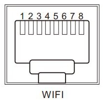

# SRNE Inverters by Modbus RS485

## Description

ESPhome integration to Home Assistant for SRNE Inverters via Modbus-RTU RS485 connection

## Connection and wiring

| | |
|-|-|
||  |

|       |        |
|:-----:|:------:|
| Pin 1 |   5V   |
| Pin 2 |  Gnd   |
| Pin 3 |    /   |
| Pin 4 |   /    | 
| Pin 5 |   /    |
| Pin 6 |   /   |
| Pin 7 | RS485-A |
| Pin 8 | RS485-B |

### Serial Communication Parameters
"9,600, n, 8, 1" indicates a baud rate of 9,600, with 8 data bits, and no parity check.
There are one host and multiple slaves in RS485 connection mode. The default address of the inverter is 1, which can be set. It supports 255
universal address. When a host and an inverter are connected one to one, 255 can be used to communicate with the inverter. The address that the
inverter responds to is the actual address.

**Warning:**  The maximum number of read-write registers at a time is 32 (0x20 HEX)

To prevent modbus communication errors as the result of automatic optimization `force_new_range: true` should be used.

## Protocol version and documentation

Integration is made on the base of SRNE Solar MODBUS Protocol for Energy Storage Inverter V2.08, 2025.05.26.

Several registers are uavailable / untested due to firmware version of available inverter.

You have to comment / uncomment (or add/remove symlink to suitable file) to select / unselect required registers

## Required hardware

Due to great number of entities adequate module is required.

For example, on Lilygo T-CAN485 ESP32 test was negative.

Seed Studio XIAO-ESP32-S3 with RS485 Breakout Board was used with positive results.

| XIAO-ESP32-S3 Board | Seeed Studio XIAO RS485-Expansion-Board |
|---|---|
|||
| https://wiki.seeedstudio.com/xiao_esp32s3_getting_started/ | https://wiki.seeedstudio.com/XIAO-RS485-Expansion-Board/|

Other, sufficient hardware can be used

## Important warnings

During installation the following message is generated:

WARNING GPIO3 is a strapping PIN and should only be used for I/O with care.
Attaching external pullup/down resistors to strapping pins can cause unexpected failures.
See https://esphome.io/guides/faq.html#why-am-i-getting-a-warning-about-strapping-pins

GPIO3 Pin is used by RS485 Breakout Board.

No any trouble is observed.

## To Do

* testing
* nice cards for API

### Detail interpretation of Fault History Records

In the remarks of section **P10 Fault Record:**

"0x04−0x0F: Data packets captured when a fault occurs,  with a total of 12 data."

More detail documentation is required to better Fault Records interpretation

### P03 Device Control Area

This part is not implemented.

You can do it, only if you exactly understand, whats are you doing.

## Known problems

### Protocol and documentation: unclarence and mismaches

#### Potentially wrong units

Probably some registers have wrong defined units. For example reg. `0xE041` to `0xE046` has described `W` as units, butformat is defined as `%.1fV`

#### Other

Hardware and Software versions should be verified. 

`EnergyStatisticsDay` should be understand better.

## **Licence**

||
|-|
| Apache License, Version 2.0 |

## **References**

* <https://gitlab.stn.pl/picoides-monitor/inverters/srne-inverters-by-modbus-rs485/>

| |
|-|
| []<https://solutionenergystorage.pl/> |
| Thanks for providing the inverter for testing |

* <https://wiki.seeedstudio.com/>

